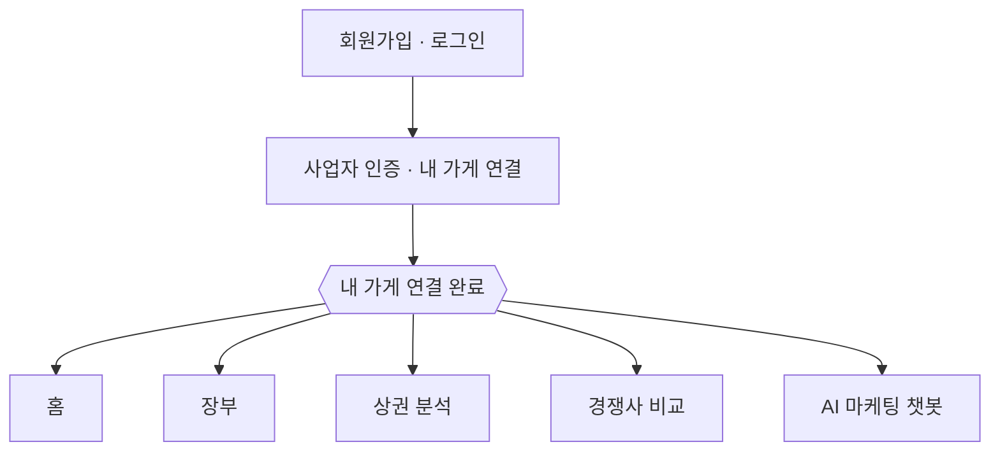
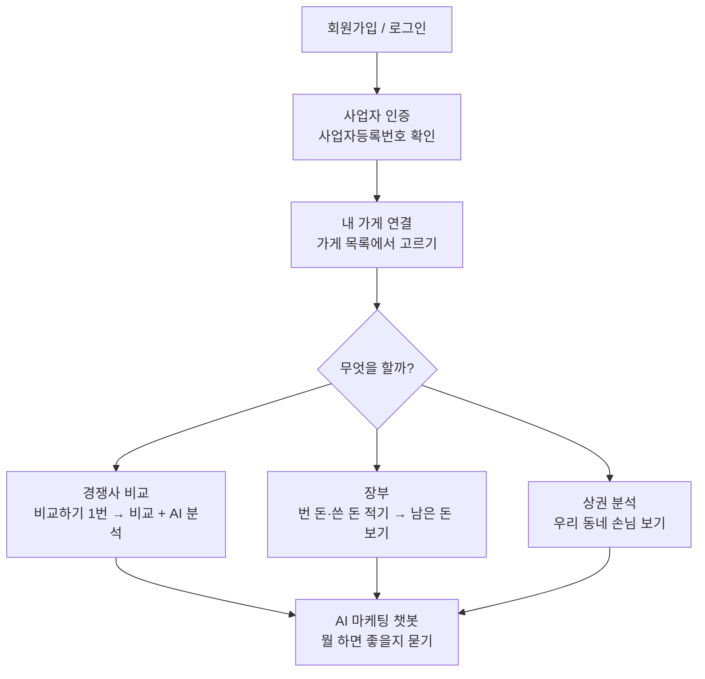
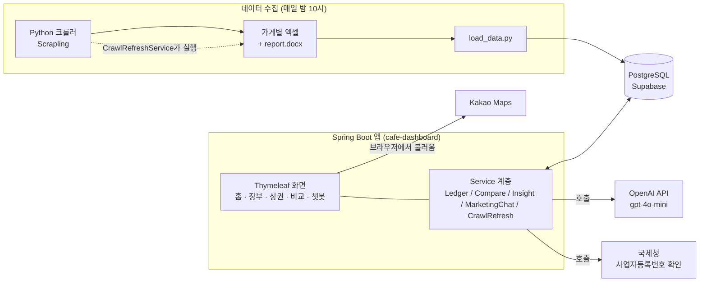
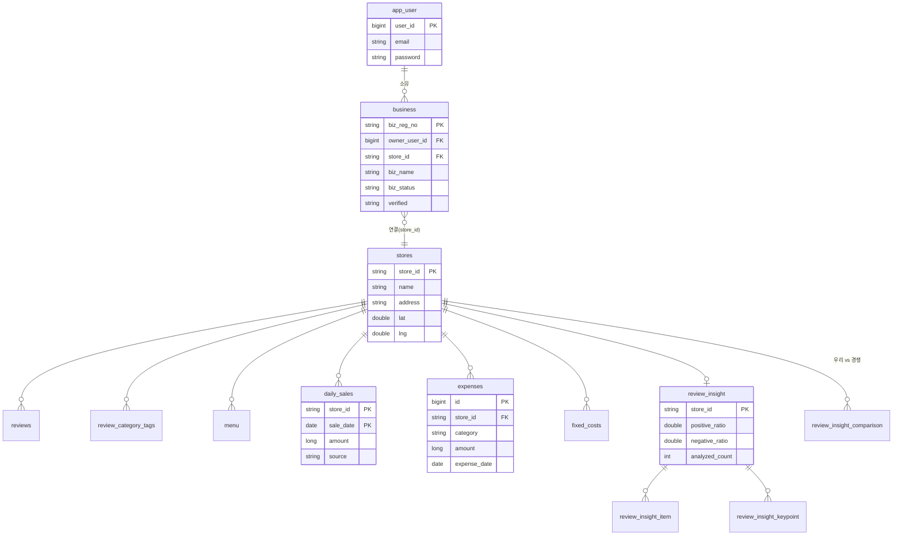

# 단골장부 (Danggol Ledger)

카페·음식점 사장님이 매출을 적으면서, 우리 동네 손님과 옆 가게를 살펴보고, AI에게 "뭘 하면 좋을까?"를 물어볼 수 있는 웹 서비스입니다.

사이트 주소: https://antonny-lee.dx6project.site

---

# 목차

1. [프로젝트 소개](#1-프로젝트-소개)
   - [서비스 한눈에 보기](#서비스-한눈에-보기)
2. [문제 정의](#2-문제-정의)
3. [MVP 범위](#3-mvp-범위)
4. [사용자 흐름](#4-사용자-흐름)
5. [주요 기능](#5-주요-기능)
6. [기술 스택](#6-기술-스택)
7. [서비스 아키텍처](#7-서비스-아키텍처)
8. [데이터 파이프라인](#8-데이터-파이프라인)
9. [ERD](#9-erd)
10. [주요 엔드포인트](#10-주요-엔드포인트)
11. [AI 코딩 에이전트 활용 방식](#11-ai-코딩-에이전트-활용-방식)
12. [트러블슈팅 기록](#12-트러블슈팅-기록)
13. [회고](#13-회고)
14. [향후 개선 방향](#14-향후-개선-방향)
15. [로컬 실행](#15-로컬-실행)

---

# 1. 프로젝트 소개

가게 사장님은 장사하느라 바빠서 이런 걸 챙기기 어렵습니다.

- 이번 달에 얼마 벌고 얼마 남았는지
- 우리 동네에 어떤 손님이 오는지
- 옆 가게는 왜 잘 되는지

단골장부는 이 세 가지를 대신 정리해 줍니다.

- 번 돈과 쓴 돈을 적으면 남은 돈(순이익)을 계산해 줍니다.
- 우리 동네 손님을 요일·시간대·나이·성별로 보여줍니다.
- 옆 가게 손님 후기를 AI가 읽고, 우리 가게와 뭐가 다른지 알려줍니다.
- 우리 가게 정보를 아는 AI에게 마케팅을 물어볼 수 있습니다.

## 서비스 한눈에 보기



내 가게를 연결하면 아래 5가지를 씁니다.

### 1) 홈 — 이번 달 장사 요약

- 앱을 열면 처음 보이는 화면
- 이번 달 매출이 지난달보다 빠른지 느린지 한눈에
- 장부에 적은 내용이 자동으로 반영됨

### 2) 장부 — 번 돈·쓴 돈 적기

- 매출: 하루 금액을 직접 넣거나, 카드사 매출 엑셀 파일을 올리면 앱이 읽어서 채움
- 지출: 재료비·월세·인건비 등 항목별로 기록, 매달 똑같이 나가는 돈(고정비)은 한 번만 등록
- 금액 칸은 숫자를 치면 바로 `1,000`처럼 쉼표가 붙음
- 결과: 이번 달 매출 − 지출 = 남은 돈(순이익). 남으면 빨강, 모자라면 파랑
- 지출이 어디에 많이 나갔는지 도넛 그래프, 지난달과 월별 비교

### 3) 상권 분석 — 우리 동네 손님 보기

- 우리 동네 상권 리포트 파일을 읽어서 그림으로 보여줌
- 5분기 매출 흐름: 우리 상권 / 자치구 / 서울시 세 줄로 비교
- 요일별 매출 순위(1·2·3등), 시간대별 매출(가장 많은 시간대 강조)
- 손님 성별 비율(여자/남자 그림), 나이대별 매출 비율(도넛)
- 유동·거주·직장 인구, 임대 시세, 주변 시설(관공서·병원·학교·교통) 개수

### 4) 경쟁사 비교 — 옆 가게와 비교

- 내 가게와 옆 가게(최대 3곳)를 고르고 "비교하기"를 한 번 누름
- 그러면 비교 + AI 후기 분석이 함께 실행됨 (최대 30초, 로딩 표시)
- 강점 키워드를 거미줄 그래프로 가게별 비교
- AI가 옆 가게 후기를 읽고: 손님이 왜 좋아하는지 / 우리와 뭐가 다른지 / 어디서 이기고 지는지 정리
- 좋은 말·나쁜 말 비율, 놓치기 쉬운 불만, 옆 가게 위치 지도
- 다른 화면 갔다 와도 로그아웃 전까지 결과가 그대로 남음

### 5) AI 마케팅 챗봇 — 뭘 하면 좋을지 묻기

- 우리 가게의 메뉴·후기·키워드·상권 정보를 AI에게 미리 알려 준 상태로 대화
- "이번 주말 이벤트 뭐 하지?", "우리 후기 불만이 뭐야?", "20대 손님 늘리려면?" 같은 질문에 우리 가게 기준으로 답

### 데이터는 어디서 오나

| 출처 | 무엇을 |
| --- | --- |
| 네이버 지도 자동 수집 (매일 밤 10시) | 가게·메뉴·후기·키워드 |
| 상권 리포트 파일(report.docx) | 매출·인구·임대 시세 |
| 사장님 직접 입력 | 매출·지출 |
| OpenAI | 후기 분석·경쟁사 비교·챗봇 답변 |

## 화면 예시

### 로그인 / 회원가입


### 사업자 인증 · 매장 연결


### 홈 화면


### 장부 (번 돈·쓴 돈 적기)


### 상권 분석 (우리 동네 손님 보기)


### 경쟁사 비교 (옆 가게와 비교)


### AI 마케팅 챗봇


---

# 2. 문제 정의

## 해결하고 싶은 문제

- 매출·지출을 엑셀이나 손으로 적어서, 이번 달에 얼마 남았는지 바로 모른다.
- 상권 리포트는 표와 숫자가 많아서 읽기 어렵다.
- 옆 가게 후기를 하나하나 읽어볼 시간이 없다.
- "그래서 뭘 하면 되는데?"에 답해 줄 곳이 없다.
- 그냥 AI 챗봇은 우리 가게를 몰라서 뻔한 말만 한다.

## 대상 사용자

- 카페·음식점을 하는 소상공인 사장님
- 매출은 적지만 분석은 못 하던 자영업자
- 가게 오픈을 준비하며 주변을 알아보는 사람

## 기대 효과

장부를 적는 김에, 이번 달 남은 돈 / 우리 동네 주 손님 / 옆 가게와의 차이를 짧은 시간에 확인하고, 다음에 뭘 할지 챗봇에 물어볼 수 있습니다.

---

# 3. MVP 범위

## 핵심 기능 3개

1. 사업자 인증 → 내 가게 연결 → 장부 쓰기 + 상권 보기
2. AI 마케팅 챗봇
3. 경쟁사 비교 (옆 가게와 강점·차이점 비교)

## 이번에 뺀 기능

- 결제 / 유료 요금제
- 카드사 매출 자동 연동 (지금은 엑셀 올리기 또는 직접 입력)
- 후기 실시간 수집 (지금은 밤에 한 번 모음)
- 스마트폰 앱 (반응형 웹만)
- 팀원 초대 / 권한 나누기
- 알림 (푸시·카카오톡)

## MVP 원칙

기능을 많이 넣기보다, 작더라도 실제로 켜지고 남들이 접속할 수 있는 상태를 먼저 만들었습니다. 이후 피드백을 받아 기능을 늘릴 예정입니다.

---

# 4. 사용자 흐름



인증과 가게 연결을 이미 끝낸 사람은, 로그인하면 인증 화면을 건너뛰고 바로 홈으로 갑니다. 이 상태는 로그아웃 전까지 유지됩니다.


---

# 5. 주요 기능

## 5.1 사업자 인증 · 가게 연결

- 사업자등록번호가 진짜인지 국세청에 물어봐서 확인합니다.
- 입력한 가게 이름이 우리가 모아 둔 가게 목록과 똑같으면, 그 가게 데이터를 "내 가게"로 연결합니다.
- 가게 이름 칸 옆의 "매장 목록 보기"에서 실제 이름을 골라 넣을 수 있습니다. (테스트용)

## 5.2 장부

- 매출: 하루 매출을 직접 넣거나, 카드사 매출 엑셀을 올리면 앱이 읽어 줍니다.
- 지출: 재료비·월세·인건비 같은 걸 항목별로 적고, 매달 똑같이 나가는 돈(고정비)은 한 번만 적습니다.
- 금액 칸은 숫자를 치면 바로 `1,000`처럼 쉼표가 붙습니다.
- 이번 달 매출 − 지출 = 순이익 (남으면 빨강, 모자라면 파랑)
- 지출이 어디에 많이 나갔는지 도넛 그래프, 지난달과 비교, 날짜별 매출 목록(펼치기/접기)

## 5.3 상권 분석

우리 동네 상권 리포트 파일(`report.docx`)을 읽어서 그림으로 보여줍니다.

- 5분기 매출 흐름: 우리 상권 / 자치구 / 서울시 세 줄로 비교
- 요일별 매출 순위: 1등·2등·3등과 나머지 목록
- 시간대별 매출: 가장 많은 시간대를 강조
- 성별 매출: 여자/남자 그림으로 비교
- 나이대별 매출: 도넛 그래프
- 유동·거주·직장 인구, 임대 시세, 주변 시설(관공서·병원·학교 등) 개수

## 5.4 경쟁사 비교

- 내 가게와 옆 가게(최대 3곳)를 고릅니다.
- "비교하기"를 한 번 누르면, 비교와 AI 후기 분석이 함께 실행됩니다. (최대 30초, 로딩 표시)
- 강점 키워드 그래프 (거미줄 모양), 가게별 색으로 구분
- AI 후기 분석: 좋은 말/나쁜 말 비율, 놓치기 쉬운 불만, 자주 나온 단어 정리
- AI 강점·차이점: 옆 가게는 왜 손님이 좋아하는지, 우리 가게와 뭐가 다른지, 어디서 이기고 어디서 지는지
- 옆 가게 위치 지도
- 동네 카페 평균과 비교한 우리 가게 후기 수 순위
- 다른 화면 갔다 와도, 로그아웃 전까지 마지막 비교 결과가 그대로 남습니다.

## 5.5 AI 마케팅 챗봇

- 우리 가게의 메뉴, 후기, 자주 나온 키워드, 상권 정보를 미리 AI에게 알려 준 상태로 대화합니다.
- "이번 주말 이벤트 뭐 하지?", "우리 후기에서 자주 나오는 불만이 뭐야?", "20대 손님 늘리려면?" 같은 질문에 우리 가게 기준으로 답합니다.

---

# 6. 기술 스택

## 화면 (Frontend)

- Thymeleaf (서버에서 HTML을 만들어 보내는 방식)
- 직접 만든 CSS, 폰트 (Noto Serif KR / IBM Plex Mono / Pretendard)
- 그래프는 라이브러리 없이 SVG로 직접 그림 (도넛 · 거미줄 · 선그래프)
- Chart.js 4 (후기 카테고리 막대 그래프)
- Kakao Maps (옆 가게 위치 지도)

## 서버 (Backend)

- Java 21, Spring Boot 4.1.0
- Spring MVC · Spring Data JPA · Spring Security(로그인) · Validation
- PostgreSQL (Supabase) · HikariCP
- Apache POI (매출 엑셀 읽기)
- Lombok, Jackson

## 데이터 수집

- Python + Scrapling (사람처럼 움직이는 자동 브라우저)로 네이버 지도에서 정보 수집
- openpyxl(엑셀), psycopg2(DB 넣기), python-dotenv
- 매일 밤 10시에 자동으로 다시 수집 (`@Scheduled(cron = "0 0 22 * * *")`)

## 저장 / 배포

- PostgreSQL (Supabase) — 사용자·사업자·장부·후기·상권·AI 결과 (테이블 20개)
- Docker (빌드용 이미지 + 실행용 이미지 2단계)
- GitHub

## AI가 하는 일

- 마케팅 챗봇 (우리 가게 정보를 알고 대화, gpt-4o-mini)
- 후기 감정 분석 (좋은 말 / 나쁜 말 비율)
- 개선 힌트 뽑기 (별점은 낮지 않은데 불만이 담긴 후기 골라내기)
- 옆 가게와의 강점·차이점 정리
- 자주 나온 단어가 뜻하는 가게 이미지 한 문장 요약
- 국세청 사업자등록번호 확인

---

# 7. 서비스 아키텍처



- 앱은 데이터베이스 표(테이블)를 만들거나 바꾸지 않습니다. 표는 `Database/create_tables_postgres.sql`, 데이터는 크롤러 + `load_data.py`가 담당합니다.
- 상권 리포트는 카드사 추정치라서 실제와 다를 수 있습니다.


---

# 8. 데이터 파이프라인

| 스크립트 | 모으는 것 | 저장 표 |
| --- | --- | --- |
| Web crawling/Home/home.py | 가게 목록·주소·지하철·좌표 | stores |
| Web crawling/Menu/menu.py | 대표 메뉴·가격 | menu |
| Web crawling/Review/Review.py | 방문자 후기 (약 6개월) | reviews |
| Web crawling/Review/Review_category.py | 후기 키워드 태그 | review_category_tags |
| Web crawling/Info/Info.py | 소개·편의시설·주차·좌석·결제 | store_intro, store_info_items |
| Web crawling/AIBriefing/AIBriefing.py | 네이버 지도 AI 요약 | ai_briefing |
| Database/load_data.py | 위 엑셀 + report.docx를 DB에 다시 넣기 | (전체) |
| Database/update_market_metrics.py 등 | 상권 리포트 수치·그래프 | market_report* |

- Review.py에는 네이버가 "요청 너무 많다(429)"고 막지 않도록, 잠깐 쉬는 시간을 랜덤으로 넣고 브라우저를 중간에 다시 켜는 로직이 있습니다.
- CrawlRefreshService가 밤에 전체 수집을 돌리고, 가게 한 곳만 다시 수집하는 것도 됩니다.

---

# 9. ERD



전체 20개 표를 묶으면:

| 묶음 | 표 |
| --- | --- |
| 가게 기본 | stores, menu, store_intro, store_info_items, ai_briefing |
| 후기 | reviews, review_category_tags |
| 상권 리포트 | market_report, market_report_metric, market_report_series, market_report_breakdown |
| 사용자 / 인증 | app_user, business |
| 장부 | daily_sales, fixed_costs, expenses |
| AI 후기 분석 | review_insight, review_insight_item, review_insight_keypoint, review_insight_comparison |


---

# 10. 주요 엔드포인트

이 앱은 데이터(JSON)를 주고받는 방식이 아니라, 서버가 완성된 화면(HTML)을 보내 주는 방식입니다. 화면 열기는 GET, 저장·변경은 POST를 쓴 뒤 화면을 다시 불러옵니다.

## 인증 / 가게

| 방법 | 주소 | 설명 |
| --- | --- | --- |
| GET | /signup, /login | 회원가입 / 로그인 |
| GET | /biz-auth | 사업자 인증 화면 (이미 끝냈으면 / 로 보냄, ?manage=1이면 그대로 보여줌) |
| POST | /biz-auth/verify | 사업자등록번호 확인 + 가게 연결 |
| POST | /biz-auth/link-store | 사업자에 가게 연결/변경 |
| POST | /biz-auth/delete | 사업자 등록 정보 삭제 |
| GET / POST | /switch-store | 가게 바꾸기 |

## 장부

| 방법 | 주소 | 값 |
| --- | --- | --- |
| GET | /ledger | view = status \| register \| history \| monthly, page |
| POST | /ledger/sales | saleDate, amount |
| POST | /ledger/sales/upload | file[] (CSV·XLSX) |
| POST | /ledger/sales/{saleDate}/delete | — |
| POST | /ledger/expenses | category, vendor, amount, paymentMethod, memo, expenseDate, recurring |
| POST | /ledger/fixed-costs/{id} | category, vendor, amount, paymentMethod, dayOfMonth, memo |

## 상권 / 비교 / 챗봇

| 방법 | 주소 | 설명 |
| --- | --- | --- |
| GET | /, /market | 홈 / 상권 분석 |
| GET | /compare | 경쟁사 비교 (값이 없으면 마지막 비교 결과를 되살림) |
| POST | /compare/analyze | 고른 옆 가게와 비교 + AI 분석 후 /compare 로 이동 |
| GET | /marketing-chat | 챗봇 화면 |
| POST | /marketing-chat/ask | message, 이전 대화 |
| GET | /stores, /stores/{id}, /stores/{id}/reviews | 가게 목록 / 상세 / 후기 |

---

# 11. AI 코딩 에이전트 활용 방식

AI를 "코드 뽑아 주는 기계"가 아니라, 설계·구현·오류 수정을 같이 하는 도구로 썼습니다.

## 나쁜 요청

```
카페 사장님용 앱 만들어줘
```

## 좋은 요청

```
Java 21 + Spring Boot(MVC, Thymeleaf, JPA)로 소상공인용 장부 + 상권 분석 서비스를 만들고 싶어.
MVP는 (1) 사업자 인증 후 가게 연결 (2) AI 마케팅 챗봇 (3) 경쟁사 비교 3개야.
DB 표는 create_tables_postgres.sql이 관리하고, 앱은 표를 건드리지 않아(ddl-auto=none).
Controller-Service-Repository 구조로 만들고, 상권 데이터는 report.docx를 읽어서 쓴다.
경쟁사 비교는 모아 둔 후기 원문을 프롬프트로 만들어 OpenAI에 넘겨 강점/차이점을 받는다.
```

## 작업 순서

```
문제 정하기
→ MVP 범위 정하기
→ 데이터 구조(ERD) · 화면 · 수집 흐름 설계
→ 만들기 (Controller → Service → Repository)
→ 로컬에서 켜서 확인
→ 오류 고치기 (배포 502, 캐시, 세션, 크롤링 429 등)
→ 배포에 반영
→ README 정리
```

---

# 12. 트러블슈팅 기록

## 12.1 배포하자마자 502 오류 (새 설정값을 안 넣음)

### 현상

지도 기능을 넣고 배포했더니 사이트 전체가 502 오류 화면이 됐습니다.

### 원인

`kakao.map-key=${KAKAO_MAP_KEY}` 를 넣었는데, 서버에 KAKAO_MAP_KEY 값이 없어서 앱이 켜지다가 멈췄습니다. 앱이 안 켜지니 사이트도 502를 띄운 것입니다.

### 해결

- 값이 없어도 켜지도록 기본값을 줬습니다: `kakao.map-key=${KAKAO_MAP_KEY:}`
- 배포 서버에 KAKAO_MAP_KEY(카카오 지도 키)를 등록했습니다.
- 새 설정값을 넣을 때는 기본값과 서버 등록을 같이 확인하기로 했습니다.

## 12.2 저장(POST)이 전부 실패함

### 현상

로그인, 장부 저장 등 저장 동작이 모두 403으로 막혔습니다.

### 원인

Spring Security가 만들어야 할 보안 쿠키(CSRF 토큰)가 안 만들어져서, 폼이 토큰을 보낼 수 없었습니다.

### 해결

- MVP 동안은 이 검사를 잠깐 껐습니다(`csrf().disable()`).
- 왜 껐는지, 나중에 다시 켜야 한다는 걸 코드에 적어 뒀습니다.

## 12.3 경쟁사 비교가 다른 화면 갔다 오면 초기화됨

### 현상

옆 가게를 골라 비교한 뒤 다른 메뉴에 갔다가 돌아오면, 고른 것과 결과가 사라졌습니다.

### 원인

비교 결과 표시 여부와 고른 가게가 주소(URL)에만 들어 있어서, 그냥 /compare 로 들어오면 처음 상태로 보였습니다.

### 해결

- 마지막 비교 상태를 로그인 중인 동안 서버가 기억하게 저장했습니다.
- 주소에 값이 없으면 기억한 값으로 되살리고, 값이 있으면 그걸 씁니다.
- 로그아웃하면 기억이 지워지므로 "로그아웃 전까지 유지"가 됩니다.

## 12.4 가게 이름이 비슷하면 엉뚱한 가게에 연결됨

### 현상

입력한 이름이 다른 가게 이름과 일부 겹치면, 다른 가게에 연결될 수 있었습니다.

### 원인

처음엔 이름이 "포함"만 되면 연결했습니다.

### 해결

- 공백·대소문자를 정리한 뒤 이름이 정확히 같은 가게만 연결하게 바꿨습니다.
- 국세청에 물어보기 전에 이름부터 확인해서 불필요한 호출도 줄였습니다.
- 폼에 "매장 목록 보기"를 넣어 올바른 이름을 고르게 했습니다.

## 12.5 크롤링 중 네이버가 막음 (429)

### 현상

후기 크롤러가 오래 돌면 네이버가 요청을 막아서, 이후 가게 수집이 실패했습니다.

### 원인

- 항상 똑같은 간격으로 요청하면 "로봇"처럼 보입니다.
- 한 화면에서 "더보기"를 수백 번 누르면 브라우저가 점점 느려집니다.

### 해결

- 가게 사이 대기 시간을 6~14초 사이 랜덤으로 바꿨습니다.
- 클릭이 일정 수를 넘으면 브라우저를 다시 켰습니다.
- 새 후기가 계속 0건이면 그 가게는 빨리 끝냅니다.

## 12.6 새 표를 안 만들어서 조회 실패

### 현상

새 엔티티(ReviewInsightKeypoint)를 추가한 뒤 로컬에서 조회가 안 됐습니다.

### 원인

앱은 표를 자동으로 만들지 않습니다(`ddl-auto=none`). 표는 create_tables_postgres.sql이 관리합니다.

### 해결

- 엔티티를 추가하면 SQL 파일에도 표를 같이 추가하고 DB에 적용합니다.
- 표의 기준은 엔티티가 아니라 SQL 파일이라는 규칙을 적어 뒀습니다.

---

# 13. 회고

## 잘 된 점

- 기능을 3개로 줄여서, 실제로 배포되고 접속되는 상태까지 만들었다.
- AI를 챗봇으로만 쓰지 않고 후기 분석·경쟁사 비교에도 넣었다.
- 수집 → 엑셀 → DB → 화면까지 데이터 흐름을 끝까지 연결했다.
- 상권 그래프를 라이브러리 없이 직접 그려서 원하는 대로 바꿀 수 있었다.

## 어려웠던 점

- 502 오류의 원인을 찾는 데 시간이 걸렸다 (서버 설정·배포가 얽힘).
- 네이버가 막는 문제 때문에 크롤링을 여러 번 손봐야 했다.
- report.docx 읽기는 문서 형식에 민감해서 예외 처리가 많았다.
- 서버가 화면을 만들어 주는 방식이라, "상태를 어디에 저장할지"를 화면마다 다시 정해야 했다.

## 배운 점

- AI에게 시킬 땐 요구사항을 잘게 나누고, 규칙(표는 SQL이 관리 등)을 분명히 알려 줘야 한다.
- 서비스는 코드만으로 끝나지 않는다. 설정값·배포·캐시·크롤링 차단·데이터 확인까지 봐야 한다.
- MVP는 작게 시작해야 진짜로 끝난다.

---

# 14. 향후 개선 방향

- 껐던 CSRF 보안 다시 켜기
- 사업자 인증을 실제 검증으로 바꾸기 (app.biz-auth.mock=false)
- 크롤링 실시간화 / 실패 알림
- 경쟁사 비교에 넣는 옆 가게 후기 수 늘리기 (지금은 가게당 3개)
- 카드사 매출 자동 연동
- 스마트폰 화면 개선
- 사용자 피드백 받는 곳 만들기

---

# 15. 로컬 실행

## 준비물

- JDK 21
- PostgreSQL 접속 정보 (Supabase 등)
- 표 한 번 만들기: Database/create_tables_postgres.sql 실행
- 데이터 넣기:
  ```bash
  pip install -r crawler-requirements.txt
  python Database/load_data.py
  ```

## 환경변수 (Database/.env, git에는 안 올라감)

```env
# PostgreSQL
PG_POOL_HOST=
PG_POOL_PORT=5432
PG_POOL_DATABASE=postgres
PG_POOL_USER=
PG_POOL_PASSWORD=

OPENAI_API_KEY=sk-...          # 챗봇 / 후기 분석
NTS_SERVICE_KEY=               # 국세청 사업자등록 확인 키
KAKAO_MAP_KEY=                 # 카카오 지도 키 (없으면 지도만 안 나옴)
```

## 실행

```powershell
cd cafe-dashboard
./run-dev.ps1        # .env 읽고 mvnw spring-boot:run → http://localhost:8080
```

## 폴더 구조

```
cafe_marketing/
├── cafe-dashboard/                 # Spring Boot 앱
│   ├── src/main/java/com/cafe/dashboard/
│   │   ├── controller/  service/  entity/  repository/
│   │   ├── openai/      nts/       security/  config/
│   ├── src/main/resources/
│   │   ├── templates/              # Thymeleaf 화면
│   │   │   └── fragments/layout.html
│   │   └── application.properties
│   ├── Dockerfile · run-dev.ps1 · pom.xml
├── Web crawling/                   # Python 크롤러
├── Database/                       # create_tables_postgres.sql · load_data.py · .env
├── report.docx                     # 상권 리포트 원본
└── crawler-requirements.txt
```

화면 이미지: docs/images/ 에 01-login.png ~ 07-marketing-chat.png, usecase.png, architecture.png, erd.png 를 넣으면 위 자리에 나옵니다.
